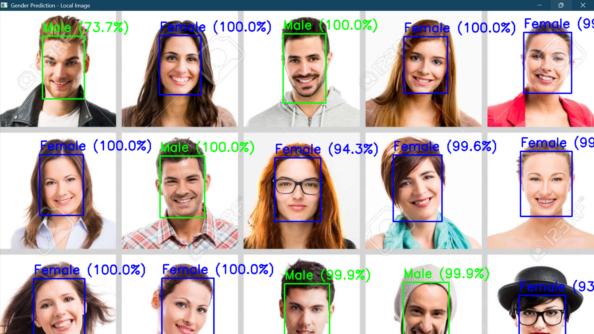
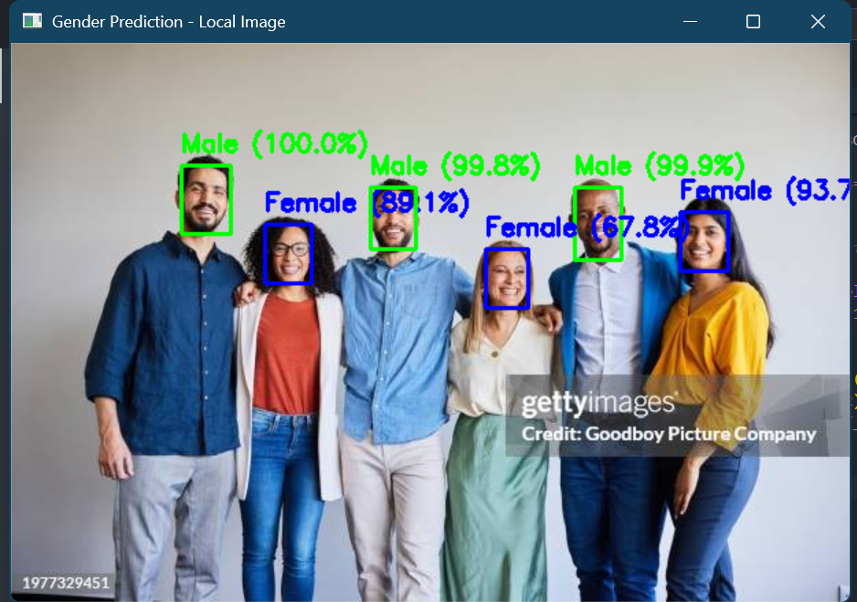

# 🔮 Real-Time Gender Classification with Deep Learning


> 🚀 A futuristic deep learning project that predicts **gender** from face images in **real-time** using your webcam or from any **local image**. Built with **TensorFlow** + **OpenCV**.

---

## ✨ Features
- 📷 Detect faces from local images & webcam stream.
- 🧠 Predict gender (`Male` / `Female`) with high accuracy.
- ⚡ Real-time inference powered by **OpenCV DNN** & **Keras CNN**.
- 🎨 Visual overlay with bounding boxes & confidence scores.
- 🔥 Easy to use & extend (plug your own models).

---

## 🎥 Demo

| Local Image Prediction | Real-Time Webcam |
|------------------------|------------------|
|  |  |

---

## 📂 Project Structure
├── models/
│ ├── deploy.prototxt.txt
│ ├── res10_300x300_ssd_iter_140000.caffemodel
├── predict_from_img.py # Run on single image
├── predict_realtime.py # Run on live webcam feed
├── requirements.txt
├── .gitignore
├── README.md

yaml
Copy code

---

## ⚡ Installation & Setup

1️⃣ **Clone Repository**
```bash
git clone https://github.com/piyush241203/gender_detect.git
cd gender_detect
2️⃣ Create Virtual Environment (Recommended)

bash
Copy code
python -m venv venv
source venv/bin/activate   # Mac/Linux
venv\Scripts\activate      # Windows
3️⃣ Install Dependencies

bash
Copy code
pip install -r requirements.txt
4️⃣ Download Pretrained Models
Place these inside models/:

deploy.prototxt.txt

res10_300x300_ssd_iter_140000.caffemodel

🚀 Usage
🔹 Run on Local Image

bash
Copy code
python predict_from_img.py
🔹 Run in Real-Time (Webcam)

bash
Copy code
python predict_realtime.py
⚙️ Tech Stack
🧠 TensorFlow/Keras – Gender classification model

🎥 OpenCV – Face detection + real-time processing

🐍 Python – Glue that makes everything work

🤝 Contributing
Pull requests are welcome! For major changes, open an issue first to discuss.
Feel free to fork and improve this futuristic AI project 🔮
